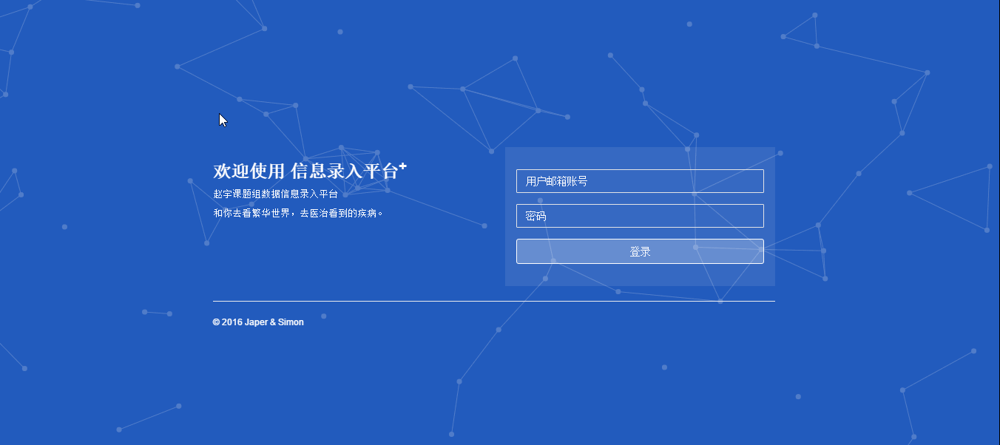

# SCU-Information_system
四川大学华西医学院耳鼻喉专业信息录入平台
------
  
  **Simon**想让我帮忙做一个信息录入平台的前端，我简单地写了一个登陆界面和后台管理界面。
  病例等信息需要更好地管理，因此建立了更便捷更高效的信息录入平台记录病例，整理疾病、知识，并将其中承载的价值传播和分享给他人。你可以使用该信息录入平台：
  > * 记录疾病
  > * 添加删除编辑疾病库
  > * 与他人协作编辑
  > * 导出excel表格

  除了您现在看到的这个托管在github上的版本，之后您还可以前往阿里云体验在线版本，链接会之后更新。

  系统能达到的功能有：
- [ ] 支持以 xls格式导出文稿
- [ ] 改进动画效果
- [x] 新增 搜索 功能
- [x] 修复后台界面动画效果卡帧等问题
- [ ] 新增 表格录入功能

  这是一个简单效果的gif图，您可以看看效果：
  